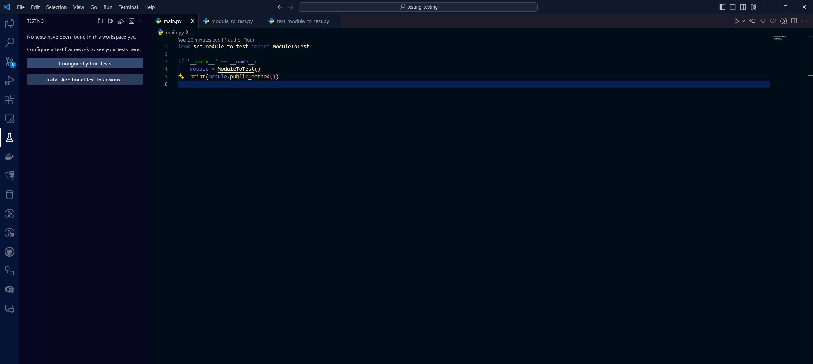
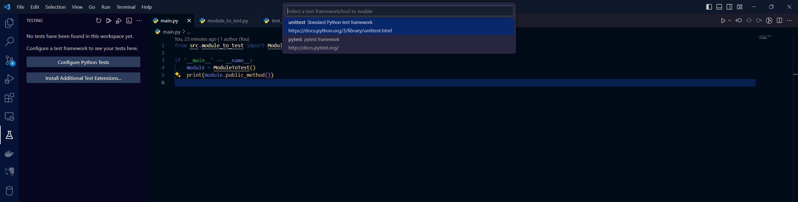
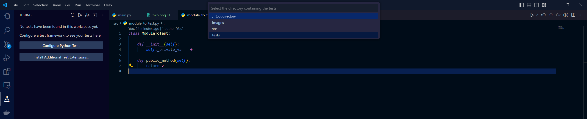
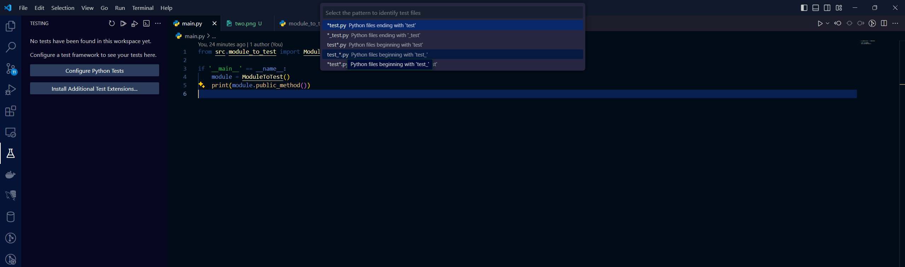
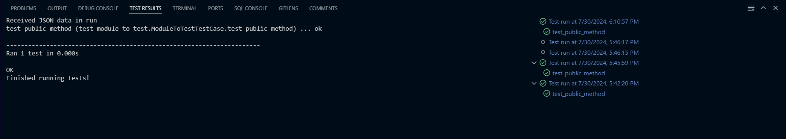
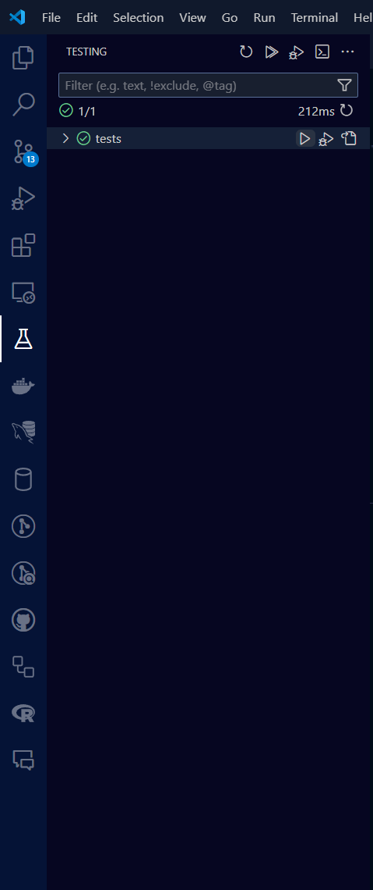
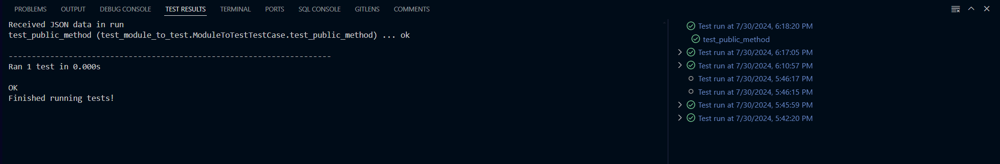

# Unittesting Report

## Steps Taken During Testing

### 1: Create a directory


### 2: Open directory in vscode


### 3: Create src and tests directories within the project


### 4: Create basic python module to test along with a basic test to run


### 5: Run command in terminal:
```
py -m unittest discover
```
**Output:**
```
----------------------------------------------------------------------
Ran 0 tests in 0.000s

NO TESTS RAN
```


### 6: Run command in terminal:
```
py -m unittest discover 'tests'
```
**Output:**
```
.
----------------------------------------------------------------------
Ran 1 test in 0.000s

OK
```


### 7: Configure python tests using inbuilt module (screenshot instructions to help guide):

**7.1:** Select Configure Tests 


**7.2:** Specify unittests


**7.3:** Select tests directory


**7.4:** Select the ``test_*.py`` option



### 8: Run the new unittests from the testing menu
**Output:** 



### 9: Create __init__.py files within ``src/`` and ``tests/``
**File Tree:**
```
.vscode/
    settings.json
images/
    one.png
    two.png
    three.png
    four.png
    five.png
main.py
src/
    __init__.py
    module_to_test.py
tests/
    __init__.py
    test_module_to_test.py
```


### 10 Run command in terminal:
```
py -m unittest discover
```
**Output:**
```
.
----------------------------------------------------------------------
Ran 1 test in 0.000s

OK
```

### Check that the Testing menu still works

